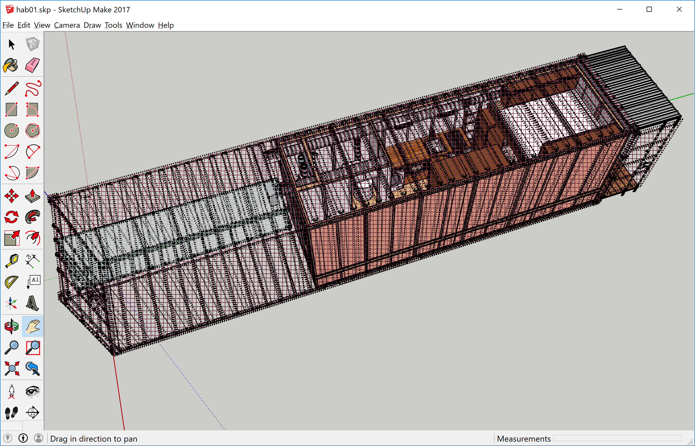
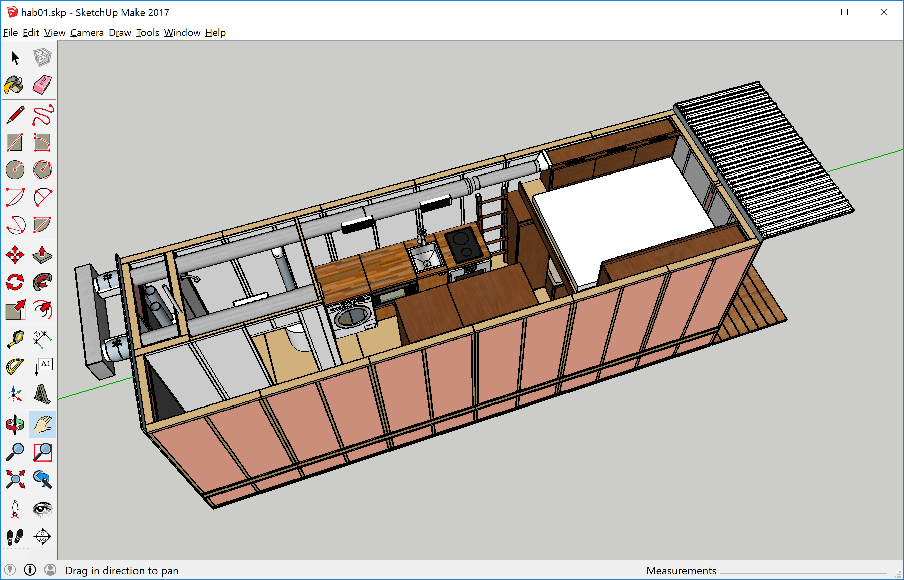

## SCHab One
Definition: SCHab - _Shipping Container Habitat_

### Description
This is an effort to design a self-contained habitat based on a standard 40' HC Shipping Container.  It's more than just a drawing.  I plan to research, document, and design each subsystem that goes into building such a habitat: electrical, plumbing, hvac, etc.  Then I plan to build one.

### Background
In order to explain why we're doing this, let me share a little background.  Currently we live in a small RV*.  We travel around the country as required by work or inclination.  While we've been doing this for about 4 years, I know we won't be doing it forever.  I can see a point when we'll want to spend time in a single location for part of the year.  Maybe at first a mixture of RV living and settled living.  Later probably more toward settled living.

**But why use a shipping container?**

A few reasons.  First, when we decided to live in an RV, mobility was the main requirement.  But we also wanted to downsize - minimal lifestyle, minimal impact, minimal cost.  A shipping container has more than enough room for us.  In fact it will be a step up from our current ride.

Second, we don't know where we'll buy land to set this up - we'll figure that out as we continue our current nomadic living.  We do have a place where we can start construction on the habitat and work on it for a few months out of the year.  So we can start building it now, purchase land later, and relocate it.

Third, even though we plan to buy land for SCHab, its unlikely we'll want keep it in one place indefinitely.  Maybe a location that appeals to us a few years from now won't work us 10 years from now.  The self contained shipping container habitat that we're planning will be relocatable. If we get tired of one place, we can have it moved to another.

**Why not a single-wide or 5th wheel trailer?**

Either of these could work but they are generally not self container.  They need water, sewer and electrical hookup.  The kind of land we're considering is generally off-grid and far from public utilities.  Electric could be brought in but that drives up the cost.  Adding a well and septic system also drives up the cost.  Minimal cost is one of our design goals.

Security is also a consideration.  Since we may only occupy our SCHab a few months out of the year, we want it to be as secure as possible while we're gone.  While nothing will keep out a determined bugler with the proper tools, a shipping container will be harder to break into than any trailer.  A shipping container will also stand up to harsh weather better.

And besides, this planning and construction is fun!

### Features
Since this is a work-in-progress the features are evolving.  Since we're use to living in our RV, some of these choices were informed by things that are working for us now.  Here's what I have so far:
* Completely contained in a 40' HC double-door shipping container.
* Single sleep area with queen size mattress
* Porch area for covered outdoor seating
* 7' x 15' garage area for a vehicle or outdoor toys
* Solar or wind electric with battery storage and AC inverter
* Single unit washer / dryer
* Marine refrigerator / freezer (12vdc)
* Oven / Stove / Microwave
* On-demand water heater (propane)
* Radiant heat
* Waterless toilet
* Storage tank for rainwater harvesting
* Provisions for a second story for those who need more space

### Getting Started
Drawing were made using [SketchUp](https://www.sketchup.com/).  The "free for non-commerical use" version, called SketchUp Make, can be downloaded at https://www.sketchup.com/download.  If you want to look at the drawings, you'll need to download and install SketchUp.

You'll want a local copy of this repository with all of the design files.  If you have GIT, you can clone the repository in the usual way.  If you have no idea what that means, you can download a zip archive by selecting the "Clone or Download" button above.

Some of the analysis is done using Microsoft Excel worksheets.  If you don't have Excel you can use the free office suite [Libre Office](https://www.libreoffice.org/).

### Project Resources

| Link | Purpose |
| -------- | ------- |
| [Research](Research/Research.md) | Information captured from research into various aspects of the project. |
| [Requirements](Requirements/Requirements.md) | Capture requirements for SCHab and its various subsystems. |
| [Design](SketchUp/Design.md) | 3D drawings |
| [Construction](Construction/Construction.md) | Information about construction considerations. |
| [Control](Control/Control.md) | Monitoring and control system. |
| [Trello Board](https://trello.com/b/0bdXyXfJ) | Here you can check on tasks I've identified and my status on those tasks. |

### Disclaimer

I am not an architect or engineer.  I didn't even stay at a Holiday Inn Express last night.  My background is science and IT.  While I'm aware of many building codes, I won't claim that any of what I have here is proper or up to code.  Frankly since this is "temporary housing", I'm not even sure what building codes apply.  Since my plan is to locate our SCHab in unincorporated areas, I'm not too concerned about it.  Obviously if you plan to build one yourself you'll want to understand the CC&R of the land you purchase and the building codes of the community.

Also, products we mention may link to Amazon.  As such, Amazon requires that we tell you the following:

"We are a participant in the Amazon Services LLC Associates Program, an affiliate advertising program designed to provide a means for us to earn fees by linking to Amazon.com and affiliated sites.”

--

\* You can read more about the RV on our blog (https://www.b190exp.com/) and follow us on [Instagram](https://www.instagram.com/b190exp/)
