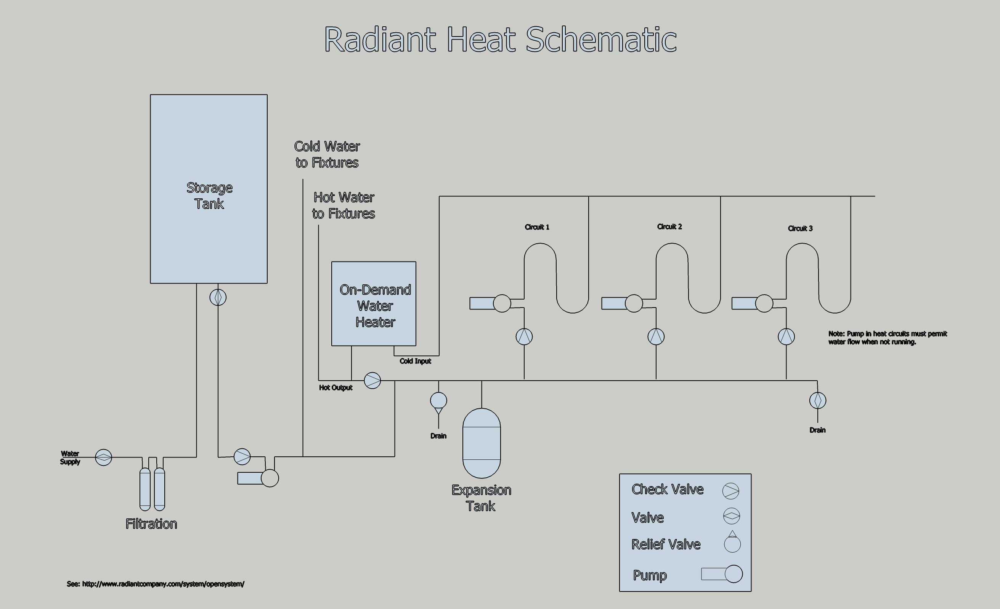

## SCHab One : Design

### Tools

Drawing were made using [SketchUp](https://www.sketchup.com/).  The "free for non-commerical use" version, called SketchUp Make, can be downloaded at https://www.sketchup.com/download.

### Schematics

These are found in the 'Schematics' directory.

### 3D Drawnings

The main SCHab 3d drawing is the file _hab01.skb_.  It is built up of various other components that can be found in the various SketchUp subdirectories.  These components can be opened and edited in SketupUp individually.  Note, however, that changes are not automatically reflected in the overall hab01.skb drawing.  You would need to select the component in hab01.skb and "reload" it from the edited component file.

I found the [shipping container model](https://3dwarehouse.sketchup.com/model/ub2c368e2-d333-4a4c-81ff-acfce363f53e/Open-Top-40ft-High-Cube-Container-w2-Doors) in the SketchUp 3D Warehouse.  It was created by OrganicZero so they deserve credit for it.

### HVAC

I don't plan for air conditioning at this time.  If you need A/C, it may be possible to add an evaporator coil to the ventilation duct or one could certainly add a split unit.  Instead a have a couple high volume blowers that will circulate outside air.  That will natural ventilation of screen doors should help keep the temperature down.

The space is small enough it could be heated with a pellet stove.  So in some sense radiant heat (my choice) is overkill.  Having lived with radiant heat in the past, I like it.  So here it is.

On a personal note, before I started living in an RV I had a fairly narrow comfort range for home temperature.  About 71F in the winter and 69F in the summer.  Now I find that I can function just fine with temperatures anywhere between 60F and 90F inside.  You just get use to it.  So I'm not inclined to design an HVAC system according to my old sensibilities.  YMMV.

#### Radiant Heat

This is an open loop system.  That means the water that heats the floor is the same water that comes out of the faucet.  With a system like this you need to make sure the water is circulated throughout the system even when heat isn't used.  You don't want the water to stagnate.  That's why you see the (strange) connection between the cold water input and the radiant heat circuit.  Basically the on-demand water heater gets its cold water input through the radiant heat system.  The folks at  [www.radiantcompany.com](http://www.radiantcompany.com/system/opensystem/) explains how this works so I won't repeat it here.
